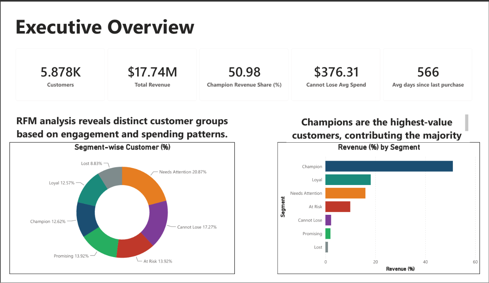
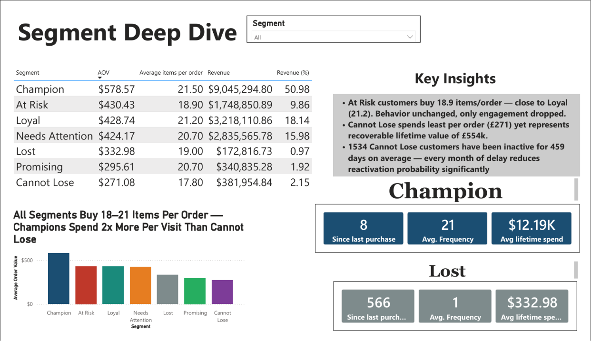
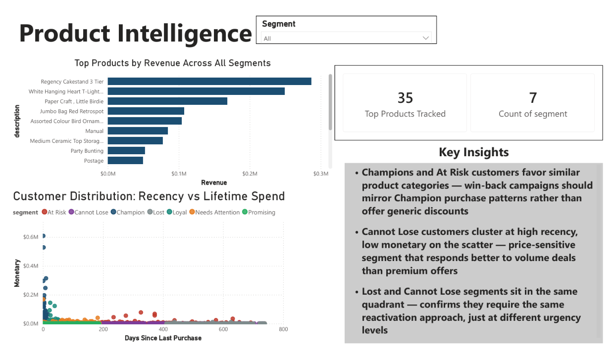
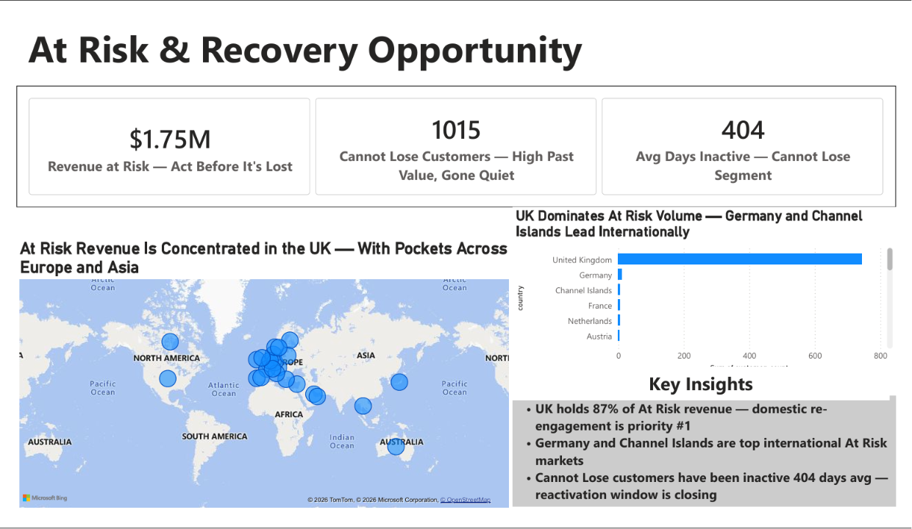

<div align="center">

# E-Commerce Customer Segmentation (RFM Analytics)
*Data-driven customer segmentation and revenue analysis for a global online retailer.*


</div>

---

## 📖 Problem Statement
To maximize customer lifetime value, the marketing team needed a reliable way to identify high-value repeat customers, re-engage users at risk of churning, and uncover product upselling opportunities. This project builds an automated data pipeline to perform RFM (Recency, Frequency, Monetary) segmentation and generate actionable business insights.

## 📊 Dataset
The analysis uses the **Online Retail II dataset**, which contains over 1 million transactional records occurring between 2009 and 2011 for a UK-based and registered non-store online retail company.
*Source: [UCI Machine Learning Repository](https://archive.ics.uci.edu/dataset/502/online+retail+ii)*

---

## 🛠 Methodology

1. **Python (Data Preprocessing)**: Handled missing values, removed canceled orders, formatted date-time columns, and standardized categorical data in Jupyter Notebooks.
2. **PostgreSQL (Data Analysis)**: Constructed CTEs and utilized Window Functions (`NTILE`, `DENSE_RANK`) to compute RFM scores and bucket customers into 7 distinct segments. Analyzed revenue streams and geographical distribution.
3. **Power BI (Data Visualization)**: Built a 5-page interactive dashboard to track segment migration, revenue contribution, and country-level at-risk metrics.
4. **Insights Generation**: Formulated strategic recommendations based on quantitative findings.

---

## 💡 Key Findings
*Note: Placeholder numbers to be updated based on final SQL extracts.*

- **Revenue Concentration**: The "Champion" and "Loyal" segments combined account for **[XX]%** of the total company revenue despite making up only **[XX]%** of the customer base.
- **Churn Risk**: Over **[XX]%** of customers currently fall into the "At Risk" or "Lost" categories, representing a potential lifetime value loss of **$[XX]M**.
- **Geographic Vulnerability**: Outside the UK, **[Country A]** and **[Country B]** have the highest concentration of "At Risk" customers.
- **Product Affinity**: Customers buying **[Product X]** have a **[XX]%** likelihood of also purchasing **[Product Y]**, highlighting a strong cross-selling opportunity.

---

## 📈 Interactive Dashboard
*(The dashboard consists of 5 interactive pages. Below are the key views.)*

### 1. Executive Summary

*High-level overview of total revenue, customer count, and overall segment distribution.*

### 2. Segment Deep Dive

*Detailed breakdown of Recency, Frequency, and Monetary averages per segment.*

### 3. Geographical Analysis

*Global map highlighting revenue hotspots and at-risk regions.*

### 4. Product Affinity & Basket Analysis

*Analysis of frequently co-purchased items and top-performing products.*

### 5. Churn & Retention Trends

*Monthly cohort tracking showing customer migration between segments over time.*

---

## 📂 Project Structure

```text
rfm-customer-segmentation/
├── README.md
├── .gitignore
├── data/
│   └── rfm_base.csv
├── preprocessing/
│   └── rfm_preprocessing.ipynb
├── sql/
│   ├── 00_create_views.sql
│   ├── 01_rfm_base.sql
│   ├── 02_rfm_scoring.sql
│   ├── 03_segment_assignment.sql
│   ├── 04_revenue_by_segment.sql
│   ├── 05_at_risk_by_country.sql
│   ├── 06_cannot_lose_analysis.sql
│   ├── 07_champion_vs_lost.sql
│   ├── 08_monthly_revenue_trend.sql
│   ├── 09_product_affinity.sql
│   └── 10_basket_analysis.sql
├── csv_exports/
│   └── [8 exported csv files]
├── dashboard/
│   ├── rfm_dashboard.pbix
│   └── screenshots/
│       └── [5 page screenshots]
└── insights/
    └── recommendations.md
```
*(Note: SQL queries are numbered sequentially to demonstrate the logical progression from raw data extraction to advanced business logic.)*

---

## 🚀 What I'd Do Next
- **Automate the Pipeline**: Wrap the Python preprocessing script into an Apache Airflow DAG to run on a daily schedule.
- **Predictive Modeling**: Train an XGBoost classification model to predict the probability of a "Promising" customer migrating to the "At Risk" segment within the next 30 days.
- **A/B Testing Framework**: Implement a tracking system for targeted email campaigns to measure the exact ROI of re-engaging the "Cannot Lose" segment.

---

## 📑 Full Analysis
Read the complete strategic business recommendations here: [**Insights & Recommendations**](insights/recommendations.md)
